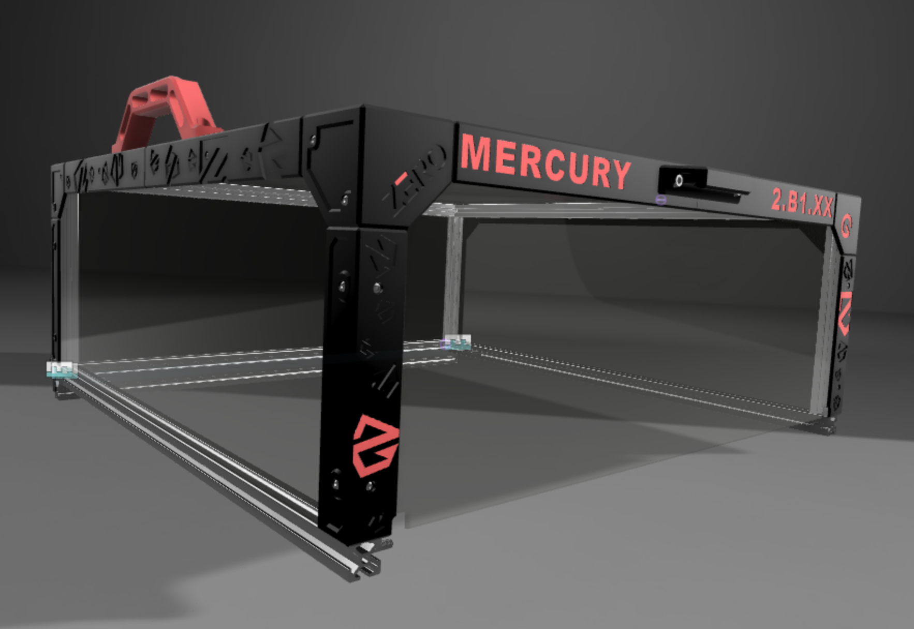
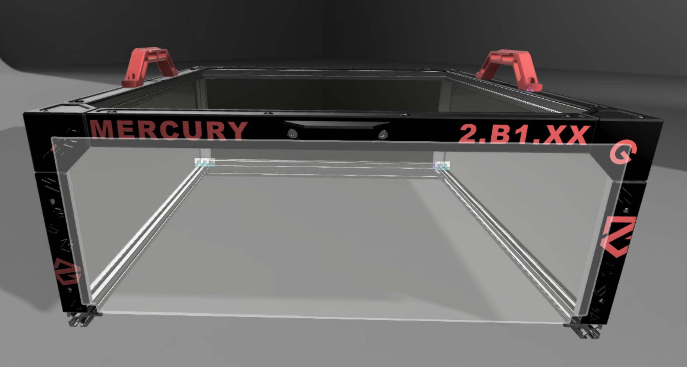
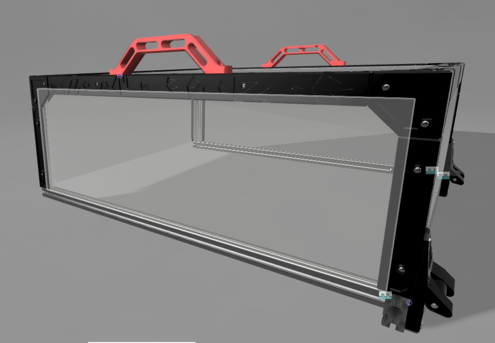

# Zero G Mercury One.1 (Ender 5 Plus) enclosure top hat

This is the top hat for Ender 5 Plus converted to [Zero G Mercury One.1](https://github.com/ZeroGDesign/Mercury/tree/BETA1.0.1) 3D printer.

## BOM

|**Item**|**Amount**|**Notes**|
|--------|----------|---------|
|2020 aluminum extrusion 594mm|2|Frame mounted side extrusions|
|2020 aluminum extrusion 574mm|2|Top hat's side extrusions|
|2020 aluminum extrusion 578mm|2|Top hat's front and back|
|2020 aluminum extrusion 195mm|4|Top hat's vertical legs|
|2040 aluminum extrusion 578mm|1|Frame mounted rear extrusion|
|M3x8 BHCS|26|Bolts, used to mount printed frame covers from the sides| 
|M3x10 BHCS|16|Bolts, used to mount printed frame covers from the top|
|M5x8 SHCS|4|Bolts, used to mount a hinge to the top hat's frame|
|M5x12 SHCS|14|Bolts, used to mount handles and to mount lower part of the hinge to the frame|
|M5x80 SHCS|2|Axes for hinges|
|M5x8 BHCS|2|Bolts, used to mount frame mounted extrusions|
|M5x12 BHCS|2|Bolts, used to mount frame mounted extrusions|
|M5x16 BHCS|12|Bolts, used for blind joints and to attach back of the frame mounted extrusions|
|M5 lock nuts|2|Nuts to fix axes|
|M3 T-nut|42||
|M5 T-nut|20||

Check the CAD model for parts at the moment.
